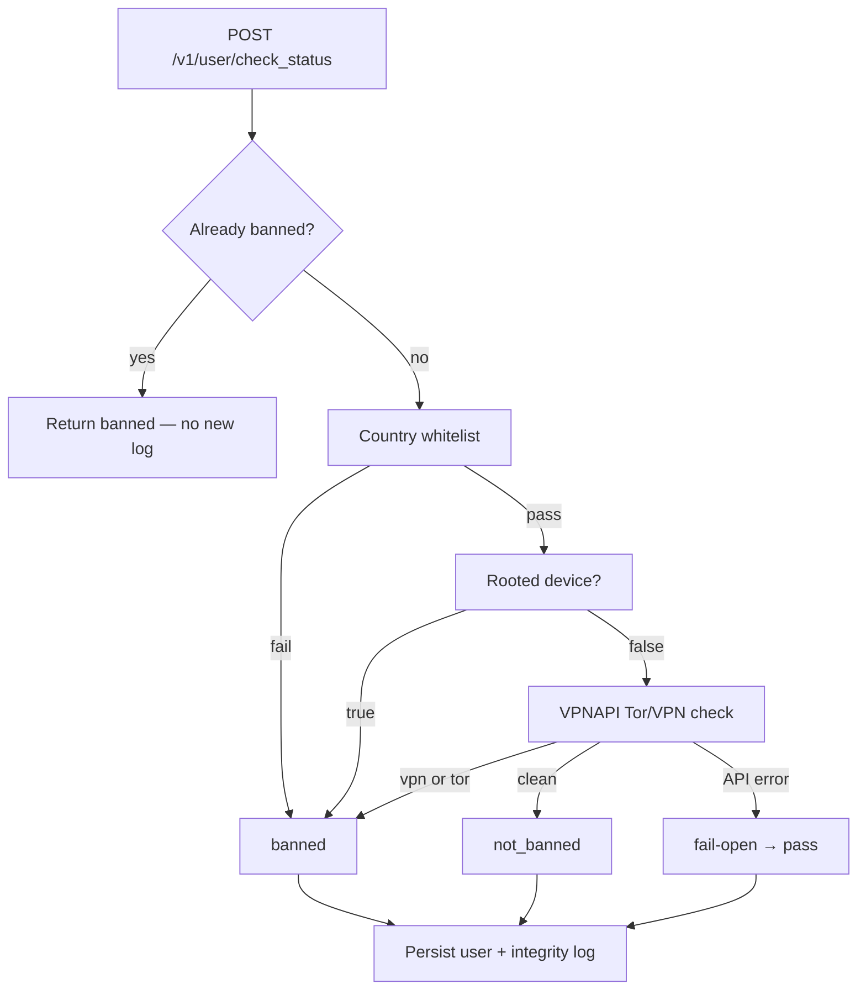

# Bluetile · User Check Status API

> **Real-time user integrity scoring** — country whitelist, device trust, and VPN/Tor detection in a single, hardened Rails 8 endpoint.

[](https://www.ruby-lang.org/)
[](https://rubyonrails.org/)
[](https://www.postgresql.org/)
[](https://redis.io/)
[](spec/)
[](spec/)

Rails **8.1 API-only** service that evaluates whether a mobile user should be **banned** or **not banned** through a deterministic security check chain — with auth, rate limiting, caching, fail-open external calls, and full audit logging.

---

## Why this exists

Mobile apps need a fast, reliable gatekeeper before granting access. This API:

- Validates **device identity** (IDFA) and **trust signals** in one call
- Runs checks in **strict order** with early exit (no wasted VPNAPI calls)
- **Persists** user state and **logs every integrity event** for forensics
- **Fails open** on VPNAPI outages (availability over false positives)
- **Fails closed** on infrastructure failure (Redis down → `500`)

Built for production-minded defaults: API key auth, per-IP throttling, health probes, and CI with security scans.

---

## Quick start

```bash
git clone git@github.com:rafael-pissardo/Bluetile.git
cd Bluetile

cp .env.example .env          # set API_KEY and VPNAPI_KEY
bin/setup --skip-server       # docker + bundle + db + seed

bundle exec rails server
```

**Manual setup**

```bash
docker compose up -d
bundle install
bundle exec rails db:create db:migrate db:seed
```

---

## The endpoint

### `POST /v1/user/check_status`

| | |
|---|---|
| **Auth** | `X-API-Key: <API_KEY>` |
| **Headers** | `Content-Type: application/json`, `CF-IPCountry` (Cloudflare) |
| **Body** | `{ "idfa": "<uuid>", "rooted_device": <boolean> }` |
| **Success** | `200` → `{ "ban_status": "not_banned" \| "banned" }` |

**Whitelisted countries** (Redis seed): `US`, `CA`, `GB`

**Base request** — reuse in the examples below:

```bash
export API_KEY=your_api_key_here
export BASE=http://localhost:3000
export IDFA=8264148c-be95-4b2b-b260-6ee98dd53bf6
```

```bash
curl -s -X POST "$BASE/v1/user/check_status" \
  -H "Content-Type: application/json" \
  -H "X-API-Key: $API_KEY" \
  -H "CF-IPCountry: US" \
  -d "{\"idfa\":\"$IDFA\",\"rooted_device\":false}"
```

---

## API scenarios

All examples assume the server is running (`bundle exec rails server`) and infrastructure is up (`docker compose up -d`).

### Success — clean user (`200`)

All checks pass: whitelisted country, device not rooted, VPNAPI reports no VPN/Tor.

```bash
curl -s -X POST "$BASE/v1/user/check_status" \
  -H "Content-Type: application/json" \
  -H "X-API-Key: $API_KEY" \
  -H "CF-IPCountry: US" \
  -d "{\"idfa\":\"$IDFA\",\"rooted_device\":false}"
```

```json
{ "ban_status": "not_banned" }
```

**Side effects:** creates `User` + `IntegrityLog` on first request for this IDFA.

---

### Ban — country not whitelisted (`200`)

Country code not in Redis set. Chain stops **before** VPNAPI.

```bash
curl -s -X POST "$BASE/v1/user/check_status" \
  -H "Content-Type: application/json" \
  -H "X-API-Key: $API_KEY" \
  -H "CF-IPCountry: XX" \
  -d "{\"idfa\":\"$(uuidgen)\",\"rooted_device\":false}"
```

```json
{ "ban_status": "banned" }
```

Use a fresh IDFA per run (`uuidgen`) to see user creation + log on first hit.

---

### Ban — missing `CF-IPCountry` header (`200`)

Treated as not whitelisted → banned.

```bash
curl -s -X POST "$BASE/v1/user/check_status" \
  -H "Content-Type: application/json" \
  -H "X-API-Key: $API_KEY" \
  -d "{\"idfa\":\"$(uuidgen)\",\"rooted_device\":false}"
```

```json
{ "ban_status": "banned" }
```

---

### Ban — rooted / jailbroken device (`200`)

Root check runs after country. VPNAPI is **not** called.

```bash
curl -s -X POST "$BASE/v1/user/check_status" \
  -H "Content-Type: application/json" \
  -H "X-API-Key: $API_KEY" \
  -H "CF-IPCountry: US" \
  -d "{\"idfa\":\"$IDFA\",\"rooted_device\":true}"
```

```json
{ "ban_status": "banned" }
```

---

### Ban — VPN detected (`200`)

Only evaluated when country + rooted checks pass. Requires `VPNAPI_KEY` in `.env`. VPNAPI flags the **client IP** (`security.vpn: true`).

```bash
curl -s -X POST "$BASE/v1/user/check_status" \
  -H "Content-Type: application/json" \
  -H "X-API-Key: $API_KEY" \
  -H "CF-IPCountry: US" \
  -d "{\"idfa\":\"$(uuidgen)\",\"rooted_device\":false}"
```

```json
{ "ban_status": "banned" }
```

> In local dev the client IP is typically `127.0.0.1`. Whether this triggers a VPN ban depends on VPNAPI's response for that IP. The test suite stubs VPNAPI to verify this path.

---

### Ban — Tor detected (`200`)

Same flow as VPN; VPNAPI returns `security.tor: true`.

```json
{ "ban_status": "banned" }
```

> Like VPN, Tor detection depends on VPNAPI's evaluation of the client IP in production. Cached in Redis for 24h per IP.

---

### Already banned user — short-circuit (`200`)

User exists with `ban_status: banned`. Check chain is **skipped**; no VPNAPI call; **no new** integrity log.

```bash
# First request — ban the user (e.g. rooted)
curl -s -X POST "$BASE/v1/user/check_status" \
  -H "Content-Type: application/json" \
  -H "X-API-Key: $API_KEY" \
  -H "CF-IPCountry: US" \
  -d "{\"idfa\":\"$IDFA\",\"rooted_device\":true}"

# Second request — same IDFA, clean signals, still banned
curl -s -X POST "$BASE/v1/user/check_status" \
  -H "Content-Type: application/json" \
  -H "X-API-Key: $API_KEY" \
  -H "CF-IPCountry: US" \
  -d "{\"idfa\":\"$IDFA\",\"rooted_device\":false}"
```

```json
{ "ban_status": "banned" }
```

---

### Status change — `not_banned` → `banned` (`200`)

Existing user re-checked; status changes → new `IntegrityLog` entry.

```bash
# 1) Create clean user
curl -s -X POST "$BASE/v1/user/check_status" \
  -H "Content-Type: application/json" \
  -H "X-API-Key: $API_KEY" \
  -H "CF-IPCountry: US" \
  -d "{\"idfa\":\"$IDFA\",\"rooted_device\":false}"

# 2) Same IDFA, now rooted → banned + new log
curl -s -X POST "$BASE/v1/user/check_status" \
  -H "Content-Type: application/json" \
  -H "X-API-Key: $API_KEY" \
  -H "CF-IPCountry: US" \
  -d "{\"idfa\":\"$IDFA\",\"rooted_device\":true}"
```

```json
{ "ban_status": "banned" }
```

---

### Re-check — status unchanged (`200`)

Existing `not_banned` user, all checks still pass → **no new** integrity log.

```bash
# Run the clean-user request twice with the same IDFA
curl -s -X POST "$BASE/v1/user/check_status" \
  -H "Content-Type: application/json" \
  -H "X-API-Key: $API_KEY" \
  -H "CF-IPCountry: US" \
  -d "{\"idfa\":\"$IDFA\",\"rooted_device\":false}"
```

```json
{ "ban_status": "not_banned" }
```

---

### VPNAPI fail-open (`200`)

When VPNAPI returns **5xx**, **429**, or **times out**, the check **passes** — user is not banned solely because the external API failed.

```json
{ "ban_status": "not_banned" }
```

| VPNAPI condition | Ban? | Rationale |
|------------------|------|-----------|
| HTTP 500 | No | Fail-open |
| HTTP 429 | No | Fail-open |
| Timeout (> `VPNAPI_TIMEOUT_MS`) | No | Fail-open |
| HTTP 200, clean | No | Normal pass |
| HTTP 200, vpn/tor true | Yes | Normal ban |

> Fail-open is verified in the test suite via WebMock stubs. Reproducing it manually requires VPNAPI to be unreachable or misconfigured.

---

### Authentication errors

#### Missing API key (`401`)

```bash
curl -s -X POST "$BASE/v1/user/check_status" \
  -H "Content-Type: application/json" \
  -H "CF-IPCountry: US" \
  -d "{\"idfa\":\"$IDFA\",\"rooted_device\":false}"
```

```json
{ "error": "Unauthorized" }
```

#### Invalid API key (`401`)

```bash
curl -s -X POST "$BASE/v1/user/check_status" \
  -H "Content-Type: application/json" \
  -H "X-API-Key: wrong-key" \
  -H "CF-IPCountry: US" \
  -d "{\"idfa\":\"$IDFA\",\"rooted_device\":false}"
```

```json
{ "error": "Unauthorized" }
```

---

### Rate limiting (`429`)

Default: **60 requests/minute per IP** on `POST /v1/user/check_status` (configurable via `RATE_LIMIT_PER_MINUTE`).

After exceeding the limit:

```json
{ "error": "Too Many Requests" }
```

```bash
# Quick stress (will hit 429 after the configured limit)
for i in $(seq 1 65); do
  curl -s -o /dev/null -w "%{http_code}\n" -X POST "$BASE/v1/user/check_status" \
    -H "Content-Type: application/json" \
    -H "X-API-Key: $API_KEY" \
    -H "CF-IPCountry: US" \
    -d "{\"idfa\":\"$(uuidgen)\",\"rooted_device\":false}"
done
```

---

### Validation errors

#### Missing `idfa` (`400`)

```bash
curl -s -X POST "$BASE/v1/user/check_status" \
  -H "Content-Type: application/json" \
  -H "X-API-Key: $API_KEY" \
  -H "CF-IPCountry: US" \
  -d '{"rooted_device":false}'
```

```json
{ "error": "Bad Request" }
```

#### Missing `rooted_device` (`400`)

```bash
curl -s -X POST "$BASE/v1/user/check_status" \
  -H "Content-Type: application/json" \
  -H "X-API-Key: $API_KEY" \
  -H "CF-IPCountry: US" \
  -d "{\"idfa\":\"$IDFA\"}"
```

```json
{ "error": "Bad Request" }
```

#### Malformed JSON (`400`)

```bash
curl -s -X POST "$BASE/v1/user/check_status" \
  -H "Content-Type: application/json" \
  -H "X-API-Key: $API_KEY" \
  -H "CF-IPCountry: US" \
  -d '{'
```

```json
{ "error": "Bad Request" }
```

#### Missing `Content-Type: application/json` (`400`)

```bash
curl -s -X POST "$BASE/v1/user/check_status" \
  -H "X-API-Key: $API_KEY" \
  -H "CF-IPCountry: US" \
  -d "{\"idfa\":\"$IDFA\",\"rooted_device\":false}"
```

```json
{ "error": "Bad Request" }
```

#### Invalid UUID (`422`)

```bash
curl -s -X POST "$BASE/v1/user/check_status" \
  -H "Content-Type: application/json" \
  -H "X-API-Key: $API_KEY" \
  -H "CF-IPCountry: US" \
  -d '{"idfa":"not-a-uuid","rooted_device":false}'
```

```json
{ "error": "Unprocessable Entity" }
```

#### Non-boolean `rooted_device` (`422`)

```bash
curl -s -X POST "$BASE/v1/user/check_status" \
  -H "Content-Type: application/json" \
  -H "X-API-Key: $API_KEY" \
  -H "CF-IPCountry: US" \
  -d "{\"idfa\":\"$IDFA\",\"rooted_device\":\"yes\"}"
```

```json
{ "error": "Unprocessable Entity" }
```

---

### Infrastructure — Redis unavailable (`500`)

When Redis is down, the API returns an error instead of silently degrading.

```json
{ "error": "Internal Server Error" }
```

> Stop Redis to observe: `docker compose stop redis`

---

### Health endpoints (no auth)

#### Liveness

```bash
curl -s "$BASE/health"
```

```json
{
  "status": "ok",
  "timestamp": "2026-07-09T12:00:00Z"
}
```

#### Deep check — Postgres + Redis

```bash
curl -s "$BASE/health/deep"
```

```json
{
  "status": "healthy",
  "checks": { "postgres": true, "redis": true },
  "timestamp": "2026-07-09T12:00:00Z"
}
```

Returns `503` with `"status": "degraded"` when a dependency is down.

---

## Scenario summary

| Scenario | HTTP | Response body | VPNAPI called? | DB log |
|----------|------|---------------|----------------|--------|
| Clean user | 200 | `not_banned` | Yes | Created |
| Country not whitelisted | 200 | `banned` | No | Created/updated |
| Missing `CF-IPCountry` | 200 | `banned` | No | Created/updated |
| Rooted device | 200 | `banned` | No | Created/updated |
| VPN / Tor detected | 200 | `banned` | Yes | Created/updated |
| Already banned user | 200 | `banned` | No | None |
| Status unchanged re-check | 200 | `not_banned` | Yes | None |
| Status change | 200 | `banned` | Depends | New log |
| VPNAPI fail-open | 200 | `not_banned` | Yes (failed) | Created/updated |
| Missing/invalid API key | 401 | `Unauthorized` | No | None |
| Rate limit exceeded | 429 | `Too Many Requests` | No | None |
| Validation error | 400/422 | `Bad Request` / `Unprocessable Entity` | No | None |
| Redis down | 500 | `Internal Server Error` | No | None |

---

## Security check chain

Checks run **in order**. First failure stops the chain — no unnecessary external calls.



| # | Check | Source | On fail |
|---|-------|--------|---------|
| 1 | Country whitelist | `CF-IPCountry` vs Redis set | `banned` |
| 2 | Rooted device | Request body | `banned` |
| 3 | Tor / VPN | [VPNAPI.io](https://vpnapi.io) (24h Redis cache) | `banned` |
| — | VPNAPI down (5xx, 429, timeout) | — | **fail-open** → `not_banned` |
| — | Redis unavailable | — | **500** |

**Short-circuits**

- Already-banned user → immediate `banned`, chain skipped, no duplicate log
- Country or rooted fails → VPNAPI never called
- Status unchanged on re-check → no new integrity log

---

## Architecture

```
app/
├── controllers/
│   ├── concerns/api_authenticatable.rb   # X-API-Key gate
│   ├── health_controller.rb              # /health, /health/deep
│   └── v1/user/check_status_controller.rb  # thin — delegates to Handler
└── services/
    ├── check_status/handler.rb           # parse → validate → orchestrate
    ├── check_status_orchestrator.rb      # chain + DB transaction
    ├── check_status_params.rb            # strong params + UUID validation
    ├── checks/                           # CountryWhitelist, RootedDevice, VpnApi
    ├── integrity_logger.rb               # swappable adapter pattern
    ├── integrity_logging/postgres_adapter.rb
    ├── redis_gateway.rb                  # Redis with infra error mapping
    └── vpn_api_client.rb                 # Faraday client + cache layer
```

**Design choices**

- **Handler pattern** — controller stays ~10 lines; all request logic is testable in isolation
- **Adapter-based logging** — swap PostgreSQL for Kafka/S3 without touching orchestrator
- **DB transaction** — user update + integrity log are atomic
- **Cloudflare trusted proxies** — correct client IP behind CDN
- **Rack::Attack** — configurable rate limit (default 60 req/min/IP)

---

## Stack

| Layer | Tech |
|-------|------|
| Runtime | Ruby 3.4.9 |
| Framework | Rails 8.1.3 (API-only) |
| Database | PostgreSQL 18 |
| Cache / whitelist | Redis 8 |
| HTTP client | Faraday |
| Security | rack-attack, Brakeman, bundler-audit |
| Tests | RSpec 8, FactoryBot, WebMock, SimpleCov |

---

## Environment

| Variable | Default | Description |
|----------|---------|-------------|
| `DATABASE_HOST` | `localhost` | PostgreSQL host |
| `DATABASE_PORT` | `5433` | PostgreSQL port (host mapping) |
| `DATABASE_USERNAME` | `bluetile` | DB user |
| `DATABASE_PASSWORD` | `bluetile` | DB password |
| `REDIS_URL` | `redis://localhost:6379/0` | Redis connection |
| `API_KEY` | — | **Required** — `X-API-Key` header value |
| `RATE_LIMIT_PER_MINUTE` | `60` | Per-IP throttle for check_status |
| `VPNAPI_KEY` | — | VPNAPI.io API key |
| `VPNAPI_CACHE_TTL` | `86400` | VPN response cache (seconds) |
| `VPNAPI_TIMEOUT_MS` | `5000` | VPNAPI request timeout |

---

## Testing

```bash
bundle exec rspec                  # 39 examples — documentation format
COVERAGE=true bundle exec rspec    # SimpleCov report (~96% line coverage)
```

**What's covered**

- Happy path + every ban trigger (country, missing header, rooted, VPN, Tor)
- Auth (`401`) and rate limiting (`429`)
- Validation errors (`400`, `422`)
- VPNAPI fail-open (500, 429, timeout)
- Redis down → `500`
- Chain short-circuit (no VPNAPI when country/rooted fails)
- Integrity log fields and idempotency rules
- Health endpoints

---

## CI

GitHub Actions on every push/PR:

- **Brakeman** + **bundler-audit** security scans
- **RuboCop** lint
- **RSpec** full suite with Postgres + Redis services

---

## HTTP status reference

| Code | When |
|------|------|
| `200` | Check completed |
| `400` | Missing field / malformed JSON |
| `401` | Missing or invalid API key |
| `422` | Invalid UUID format |
| `429` | Rate limit exceeded |
| `500` | Redis or other infrastructure failure |

---

## License

Built as the **Bluetile RoR technical assessment** — Ruby on Rails, PostgreSQL, Redis, and production-grade API design.
