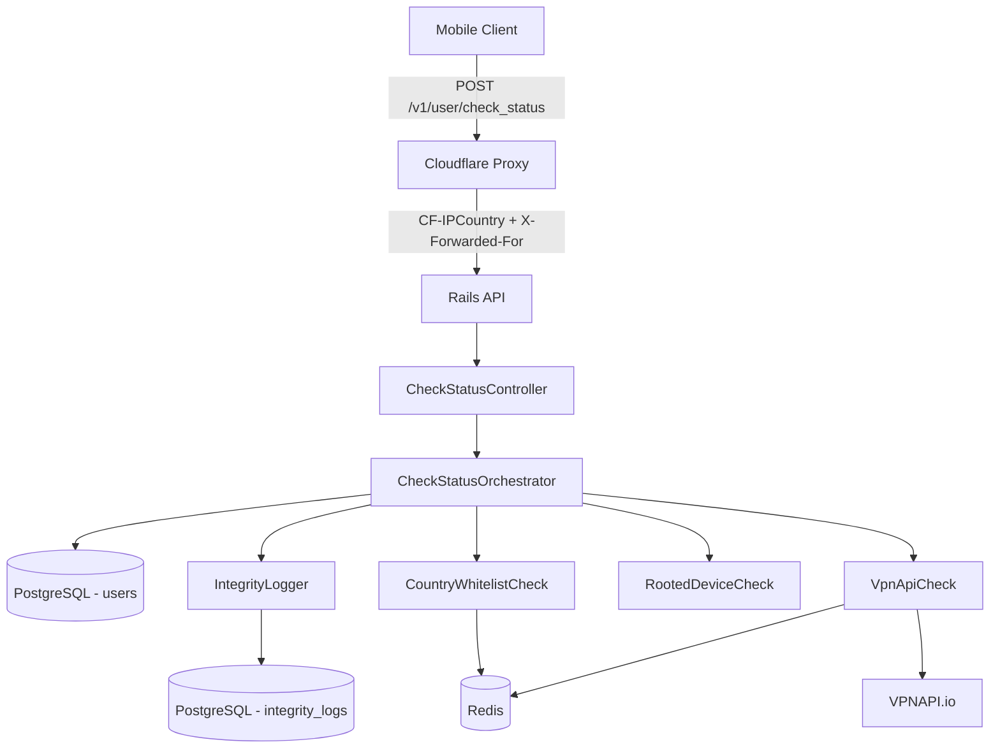

# TDD - Bluetile User Check Status API

| Field           | Value                                      |
| --------------- | ------------------------------------------ |
| Tech Lead       | TBD (Candidate)                            |
| Product Manager | N/A (Technical Assessment)               |
| Team            | Individual submission                      |
| Epic/Ticket     | Bluetile RoR Test - Sawan                  |
| Figma/Design    | N/A                                        |
| Status          | Draft                                      |
| Created         | 2026-07-09                                 |
| Last Updated    | 2026-07-09 (version pinning)               |

---

## Context

Bluetile requires a Ruby on Rails API-only application that evaluates whether a mobile user should be banned based on a chain of integrity and security checks. The primary entry point is a single endpoint, `POST /v1/user/check_status`, which receives device identifiers and security signals and returns a ban decision.

**Background**:

The application sits behind a Cloudflare proxy, which injects geo-location headers (notably `CF-IPCountry`). The API must combine header-based geo filtering, client-reported device integrity signals, and third-party IP reputation data (Tor/VPN detection via VPNAPI) to produce a consistent ban status. User state is persisted in PostgreSQL, and Redis is used for caching and configuration (country whitelist, VPNAPI responses).

**Domain**:

User integrity / fraud prevention — determining whether a device/user should be allowed or banned based on geographic, device, and network risk signals.

**Stakeholders**:

- Bluetile engineering (evaluators of the technical assessment)
- End users (mobile app clients sending IDFA and device signals)
- Operations (future monitoring of ban rates and external API health)

---

## Problem Statement & Motivation

### Problems We're Solving

- **No centralized ban decision endpoint**: Mobile clients need a single API to determine whether a user/device is allowed or banned, based on multiple security signals evaluated in a consistent order.
  - Impact: Without a unified endpoint, ban logic would be duplicated across clients or services, leading to inconsistent enforcement.

- **Multi-signal fraud detection**: Ban decisions depend on country whitelist, rooted device status, and Tor/VPN IP detection — each with different data sources and failure modes.
  - Impact: Ad-hoc checks in controllers would be hard to test, extend, or audit.

- **No audit trail for ban status changes**: When a user's ban status changes, there is no record of the signals that drove the decision.
  - Impact: Cannot investigate false positives, debug VPNAPI issues, or comply with future audit requirements.

### Why Now?

- This is a scoped technical assessment to validate Rails API design, external integration patterns, caching strategy, and test coverage.
- The design must demonstrate production-minded patterns (service layer, extensibility, fail-open on external API errors) within a small deliverable.

### Impact of NOT Solving

- **Business**: Inconsistent ban enforcement; higher fraud/abuse risk in production scenarios.
- **Technical**: Tightly coupled controllers, untestable check logic, no path to add new ban reasons or log destinations.
- **Users**: Incorrect bans (false positives) or missed bans (false negatives) without traceability.

---

## Scope

### ✅ In Scope (V1 - MVP)

- Rails 8.1 API-only application with `POST /v1/user/check_status`
- Security check chain (ordered, short-circuit on ban):
  1. CF-IPCountry header vs Redis country whitelist
  2. Rooted device check (`rooted_device == true` → ban)
  3. Tor/VPN check via VPNAPI with 24h Redis cache; fail-open on API errors
- User persistence: create on new IDFA, update on existing IDFA
- Short-circuit: already-banned users skip checks and return `"banned"`
- Re-run full check chain for users currently `"not_banned"`
- `IntegrityLog` records on user creation and on `ban_status` change
- `IntegrityLogger` service abstraction for future log routing
- `User.ban_status` designed as extensible enum (not hard-coded binary only)
- RSpec test suite covering all PDF requirements — fundamental scenarios only, no over-engineering
- Local git repository deliverable (zip submission)

**Local development infrastructure**:

- Docker Compose with PostgreSQL 18 and Redis 8 services for local development and test environments

**Request validation** (inferred from PDF request example):

- `idfa`: required, valid UUID format (e.g., `8264148c-be95-4b2b-b260-6ee98dd53bf6`)
- `rooted_device`: required, strict boolean (`true` / `false`; reject null, strings, or missing field)
- `Content-Type: application/json` enforced on the endpoint

**HTTP error responses** (API best practice, not specified in PDF):

- `400 Bad Request` — malformed JSON or missing required parameters
- `422 Unprocessable Entity` — syntactically valid request with invalid field values (e.g., invalid UUID, non-boolean `rooted_device`)
- `200 OK` — successful check; body always includes `{ "ban_status": "..." }`

### ❌ Out of Scope (V1)

- Authentication/authorization on the endpoint (not specified in requirements)
- Admin UI for country whitelist management
- Webhooks or async processing of checks
- Rate limiting on the endpoint itself
- Additional ban statuses beyond `banned` / `not_banned` (only designed for, not implemented)
- Alternative log sinks (only interface + PostgreSQL adapter)
- Production deployment, CI/CD pipeline, or infrastructure provisioning
- Cloudflare Worker configuration (assumed pre-configured upstream)

### 🔮 Future Considerations (V2+)

- Additional `ban_status` values (e.g., `suspended`, `under_review`)
- Route `IntegrityLog` to Kafka, S3, or external SIEM via adapter
- Admin API to manage Redis country whitelist
- Metrics dashboard for ban rates by country/check type
- API authentication (API keys or JWT)
- Relay detection (iCloud Private Relay) as separate check

---

## Technical Stack & Version Pinning

All dependencies use the **latest stable versions** as of July 2026. Versions must be pinned in `.ruby-version`, `Gemfile`, and `docker-compose.yml` to ensure reproducible builds.

### Runtime & Infrastructure

| Component    | Version   | Notes |
| ------------ | --------- | ----- |
| **Ruby**     | 4.0.5     | Latest stable (ruby-lang.org). Rails 8.1 requires Ruby ≥ 3.2.0 |
| **Rails**    | 8.1.3     | Latest stable 8.x (PDF requires Rails 8; 8.1 is current patch line) |
| **PostgreSQL** | 18.4    | Docker image: `postgres:18-alpine` |
| **Redis**    | 8.8.0     | Docker image: `redis:8-alpine` |

### Application Gems (Gemfile)

| Gem                         | Version | Purpose |
| --------------------------- | ------- | ------- |
| `rails`                     | 8.1.3   | API framework |
| `pg`                        | 1.6.3   | PostgreSQL adapter |
| `redis`                     | 5.4.1   | Redis client (whitelist + VPNAPI cache) |
| `faraday`                   | 2.14.3  | HTTP client for VPNAPI integration |

### Test Gems (Gemfile `:test` group)

| Gem                 | Version | Purpose |
| ------------------- | ------- | ------- |
| `rspec-rails`       | 8.0.4   | Request and service specs |
| `factory_bot_rails` | 6.5.1   | `:user` factory only |
| `webmock`           | 3.26.2  | Stub VPNAPI HTTP calls in specs |

**Not included** (avoid over-engineering): SimpleCov, VCR, Capybara, `database_cleaner` — Rails transactional fixtures are sufficient for this API.

### Docker Compose Services

| Service    | Image Tag           | Port (host) |
| ---------- | ------------------- | ----------- |
| PostgreSQL | `postgres:18-alpine` | 5432        |
| Redis      | `redis:8-alpine`     | 6379        |

**PostgreSQL volume**: mount at `/var/lib/postgresql/data` (required for data persistence on PostgreSQL 17 and below; for PG 18+ follow image `PGDATA` conventions if upgrading).

### Version Pinning Strategy

- Pin exact versions in `Gemfile` (e.g., `gem "rails", "8.1.3"`) — no pessimistic constraint (`~>`) unless a transitive dependency requires it
- Commit `.ruby-version` with `4.0.5`
- Lock dependencies with `Gemfile.lock` committed to the repository
- Re-check RubyGems and Docker Hub before implementation if more than a few weeks pass since this TDD was written

### Scaffold Command (reference)

```bash
rails new bluetile_api --api --database=postgresql --skip-test
```

Then add pinned gems and Docker Compose services per tables above.

---

## Technical Solution

### Architecture Overview

The solution follows a layered architecture: **Controller → Orchestrator → Check Services → External/Cache/Data layers**. Each security check is an isolated service object that returns a pass/fail result with metadata. An orchestrator runs checks in order, short-circuiting on the first ban. User and log persistence are handled in a transaction after checks complete.

**Key Components**:

- **CheckStatusController**: Accepts POST, validates input, extracts request context (IP, headers), delegates to orchestrator, returns JSON response.
- **CheckStatusOrchestrator**: Loads/creates user, short-circuits if already banned, runs check chain, updates user, triggers integrity logging.
- **CountryWhitelistCheck**: Reads `CF-IPCountry` header, compares against Redis set/key of allowed country codes.
- **RootedDeviceCheck**: Bans if `rooted_device` is `true`.
- **VpnApiCheck**: Calls VPNAPI for client IP; caches full response in Redis (24h TTL); bans if `security.tor` or `security.vpn` is true; passes on API failure.
- **VpnApiClient**: HTTP client wrapper for VPNAPI with timeout and error classification.
- **IntegrityLogger**: Facade service; delegates to configurable adapter (default: PostgreSQL `IntegrityLog` writer).
- **User / IntegrityLog**: ActiveRecord models backed by PostgreSQL.

**Architecture Diagram**:



### Request Processing Flow

1. Client sends POST with `idfa` and `rooted_device` through Cloudflare.
2. Controller validates JSON body and extracts:
   - `CF-IPCountry` header (country code, e.g., `US`)
   - Client IP from `request.remote_ip` (Rails trusts Cloudflare proxy headers when configured)
3. Orchestrator finds user by `idfa` or initializes new record.
4. If user exists and `ban_status == banned` → return `{ "ban_status": "banned" }` immediately (no checks, no log unless policy requires — spec says skip check chain only).
5. Run check chain in order; stop at first failing check:
   - Country not in whitelist → `banned`
   - Rooted device → `banned`
   - Tor or VPN detected → `banned`
   - All pass → `not_banned`
6. Persist user (`create` or `update` `ban_status`).
7. If new user OR `ban_status` changed → `IntegrityLogger` writes log record with full context.
8. Return `{ "ban_status": "<result>" }`.

### Check Chain Decision Table

| Step | Check              | Input                         | Ban Condition                          | On External Failure |
| ---- | ------------------ | ----------------------------- | -------------------------------------- | ------------------- |
| 1    | Country whitelist  | `CF-IPCountry` header         | Country not in Redis whitelist         | Ban (missing/invalid header treated as not whitelisted) |
| 2    | Rooted device      | `rooted_device` from body     | `rooted_device == true`                | N/A                 |
| 3    | Tor/VPN (VPNAPI)   | Client IP                     | `security.tor == true` OR `security.vpn == true` | **Pass** (fail-open) |

### APIs & Endpoints

| Endpoint                  | Method | Description                    | Request Body                          | Response                    |
| ------------------------- | ------ | ------------------------------ | ------------------------------------- | --------------------------- |
| `/v1/user/check_status`   | POST   | Evaluate user ban status       | `{ idfa, rooted_device }`             | `{ ban_status }`            |

**Request Example**:

```json
{
  "idfa": "8264148c-be95-4b2b-b260-6ee98dd53bf6",
  "rooted_device": false
}
```

**Response Example**:

```json
{
  "ban_status": "not_banned"
}
```

**Validation Rules**:

| Field           | Type    | Required | Constraints                          |
| --------------- | ------- | -------- | ------------------------------------ |
| `idfa`          | string  | yes      | Valid UUID format                    |
| `rooted_device` | boolean | yes      | Must be present (not null)           |

**HTTP Status Codes**:

| Code | Condition                                      |
| ---- | ---------------------------------------------- |
| 200  | Successful check (always returns ban_status)   |
| 400  | Invalid/missing request parameters             |
| 422  | Unprocessable entity (validation errors)       |
| 500  | Unexpected server error                        |

### Database Changes

**Table: `users`**

| Column       | Type         | Constraints                    | Notes                              |
| ------------ | ------------ | ------------------------------ | ---------------------------------- |
| `id`         | bigint       | PK, auto-increment             |                                    |
| `idfa`       | uuid/string  | NOT NULL, UNIQUE               | Device identifier                  |
| `ban_status` | string/enum  | NOT NULL, default `not_banned` | Extensible: `banned`, `not_banned` |
| `created_at` | timestamp    | NOT NULL                       |                                    |
| `updated_at` | timestamp    | NOT NULL                       |                                    |

**Indexes**: Unique index on `idfa`.

**Table: `integrity_logs`**

| Column          | Type      | Constraints | Notes                                    |
| --------------- | --------- | ----------- | ---------------------------------------- |
| `id`            | bigint    | PK          |                                          |
| `idfa`          | uuid/string | NOT NULL  | Snapshot at time of event                |
| `ban_status`    | string    | NOT NULL    | Resulting status                         |
| `ip`            | string    | nullable    | Client IP at check time                  |
| `rooted_device` | boolean   | nullable    | From request body                        |
| `country`       | string    | nullable    | From `CF-IPCountry` header               |
| `proxy`         | boolean   | nullable    | From VPNAPI `security.proxy`             |
| `vpn`           | boolean   | nullable    | From VPNAPI `security.vpn`               |
| `created_at`    | timestamp | NOT NULL    |                                          |

**Indexes**: Index on `idfa`, index on `created_at` (for audit queries).

**Ban Status Extensibility**:

Use Rails `enum` with string backing (or PostgreSQL enum type with migration path). New values can be added via migration without schema redesign. Application logic in V1 only assigns `banned` / `not_banned`, but validation and DB allow future values.

### Redis Usage

| Key Pattern                    | Purpose                          | TTL        | Example Value        |
| ------------------------------ | -------------------------------- | ---------- | -------------------- |
| `country_whitelist`            | Set of allowed ISO country codes | None       | `{ "US", "CA", "GB" }` |
| `vpnapi:ip:{ip_address}`       | Cached VPNAPI JSON response      | 24 hours   | Full API response JSON |

**Country Whitelist**: Stored as a Redis SET. Populated via seed task or rake task for local/test environments. Production population is out of V1 scope but documented for ops.

**VPNAPI Cache**: Store serialized JSON response keyed by IP. On cache hit, skip HTTP call. TTL = 86400 seconds (24 hours).

### External Integration: VPNAPI

**Endpoint**: `GET https://vpnapi.io/api/{ip}?key={api_key}`

**Relevant Response Fields**:

```json
{
  "ip": "8.8.8.8",
  "security": {
    "vpn": false,
    "proxy": false,
    "tor": false,
    "relay": false
  }
}
```

**Ban Logic**: Ban if `security.tor == true` OR `security.vpn == true`. Store `proxy` and `vpn` in integrity log regardless.

**Fail-Open Policy**: If VPNAPI returns rate limit (429), server error (5xx), timeout, or network error → treat check as **passed** (do not ban). Log the failure for observability.

**Rate Limits**: Free tier = 1000 requests/day. Caching mitigates repeated lookups for same IP.

### IntegrityLogger Service Design

**Purpose**: Decouple log persistence from check orchestration to allow future routing.

**Interface** (conceptual):

- `log(event)` — accepts structured event payload

**Event Payload Schema**:

| Field           | Type    | Description                          |
| --------------- | ------- | ------------------------------------ |
| `idfa`          | string  | User device identifier               |
| `ban_status`    | string  | Resulting ban status                 |
| `ip`            | string  | Client IP                            |
| `rooted_device` | boolean | Device root flag                     |
| `country`       | string  | CF-IPCountry value                   |
| `proxy`         | boolean | VPNAPI proxy detection (nullable)    |
| `vpn`           | boolean | VPNAPI vpn detection (nullable)      |
| `trigger`       | string  | `user_created` or `status_changed`   |

**V1 Adapter**: `PostgresIntegrityLogAdapter` — writes to `integrity_logs` table.

**Future Adapters**: Kafka, S3, stdout (for debugging) — swappable via configuration.

### Configuration & Environment Variables

| Variable              | Purpose                          | Required |
| --------------------- | -------------------------------- | -------- |
| `DATABASE_URL`        | PostgreSQL connection            | yes      |
| `REDIS_URL`           | Redis connection                 | yes      |
| `VPNAPI_KEY`          | VPNAPI.io API key                | yes      |
| `VPNAPI_CACHE_TTL`    | Cache TTL in seconds (default 86400) | no   |
| `VPNAPI_TIMEOUT_MS`   | HTTP timeout for VPNAPI calls    | no       |

---

## Risks

| Risk | Impact | Probability | Mitigation |
| ---- | ------ | ----------- | ---------- |
| VPNAPI rate limit exceeded | Medium | Medium | 24h Redis cache per IP; fail-open on 429; monitor daily quota |
| VPNAPI downtime causes missed bans | Medium | Low | Fail-open is spec requirement; log all API failures; alert in production |
| Missing/spoofed `CF-IPCountry` header | High | Low | Treat missing header as not whitelisted (ban); document reliance on Cloudflare |
| False positives from VPN detection | Medium | Medium | Integrity logs enable investigation; future allowlist for corporate VPNs |
| Redis unavailable | High | Low | Country check and VPN cache fail; define behavior: fail closed for whitelist (ban) or degrade gracefully — recommend fail closed for country, skip cache for VPNAPI |
| IDFA privacy/regulatory concerns | Low | Low | Document data retention policy; IDFA is standard mobile identifier in scope of test |
| Scope creep (extra features) | Medium | High | Strict adherence to PDF requirements; extensibility via interfaces only |

---

## Implementation Plan

| Phase | Task | Description | Owner | Status | Estimate |
| ----- | ---- | ----------- | ----- | ------ | -------- |
| **Phase 1 - Setup** | Rails app scaffold | Rails 8.1.3 API-only, Ruby 4.0.5, PostgreSQL + Redis gems | Dev | TODO | 2h |
| | Docker Compose | `postgres:18-alpine` + `redis:8-alpine` | Dev | TODO | 1h |
| | Environment config | VPNAPI key, Redis URL, trusted proxies for Cloudflare | Dev | TODO | 1h |
| **Phase 2 - Data Layer** | User model + migration | `idfa`, `ban_status` enum, timestamps | Dev | TODO | 1h |
| | IntegrityLog model + migration | All specified fields | Dev | TODO | 1h |
| | Factories | `:user` factory only | Dev | TODO | 15m |
| **Phase 3 - Services** | CountryWhitelistCheck | Redis SET lookup vs CF-IPCountry | Dev | TODO | 1h |
| | RootedDeviceCheck | Boolean evaluation | Dev | TODO | 30m |
| | VpnApiClient + VpnApiCheck | HTTP client, Redis cache, fail-open | Dev | TODO | 3h |
| | CheckStatusOrchestrator | Chain execution, short-circuit, user upsert | Dev | TODO | 2h |
| | IntegrityLogger + adapter | Service + PostgreSQL adapter | Dev | TODO | 1h |
| **Phase 4 - API** | Routes + Controller | POST endpoint, JSON response | Dev | TODO | 1h |
| | Request validation | UUID `idfa`, boolean `rooted_device`, Content-Type check | Dev | TODO | 1h |
| | HTTP error handling | 400 (malformed/missing), 422 (invalid values) | Dev | TODO | 30m |
| | Request context extraction | IP, CF-IPCountry from headers | Dev | TODO | 1h |
| **Phase 5 - Testing** | Request specs | One spec file: full endpoint flows per PDF | Dev | TODO | 3h |
| | Service specs | `VpnApiCheck` only: fail-open + cache hit | Dev | TODO | 1h |
| **Phase 6 - Deliverable** | Seed/rake tasks | Country whitelist seed data | Dev | TODO | 30m |
| | README | Setup, run, test instructions | Dev | TODO | 1h |
| | Git repo + zip | Clean commit history, zip for submission | Dev | TODO | 30m |

**Total Estimate**: ~3 days (small project, assessment scope)

**Dependencies**:

- Phase 2 before Phase 3 (models needed for orchestrator)
- Phase 3 before Phase 4 (services before controller)
- VPNAPI key required before VpnApiCheck integration tests
- Redis running before country/VPN cache tests

---

## Security Considerations

### Authentication & Authorization

- **V1**: No authentication specified in requirements. Endpoint is open.
- **Recommendation for production**: Add API key or mutual TLS; out of V1 scope but noted as gap.

### Data Protection

**Encryption**:

- **At Rest**: PostgreSQL and Redis encryption depends on infrastructure (document for production).
- **In Transit**: TLS for all external calls (VPNAPI); HTTPS behind Cloudflare in production.
- **Secrets**: `VPNAPI_KEY` in environment variables only; never committed to git.

**PII Handling**:

- **Collected**: IDFA (device identifier), IP address, country code
- **Retention**: Integrity logs retained indefinitely in V1; production should define retention policy
- **Logging**: Do not log VPNAPI keys or full request headers in application logs

### Input Validation

- Validate `idfa` as UUID format before DB lookup
- Reject missing or non-boolean `rooted_device`
- Sanitize IP before VPNAPI URL construction (prevent SSRF via malformed IP)

### External API Security

- VPNAPI key passed as query parameter (their API design); restrict key to backend only
- Set HTTP timeout on VPNAPI calls to prevent slowloris/resource exhaustion
- Cache responses to reduce attack surface (fewer external calls)

### Header Trust

- `CF-IPCountry` is trusted because traffic comes through Cloudflare
- Configure Rails `config.action_dispatch.trusted_proxies` for Cloudflare IP ranges so `request.remote_ip` reflects real client IP

### Compliance Notes

- IDFA collection may fall under mobile advertising/privacy regulations (ATT on iOS); out of scope for test but relevant for production deployment

---

## Testing Strategy

### Principles

- **RSpec only** — no extra test frameworks or coverage tooling
- **Request specs first** — one primary spec file exercises the endpoint end-to-end (HTTP → checks → DB → response)
- **Service specs sparingly** — only for logic hard to assert via HTTP (`VpnApiCheck` fail-open and Redis cache)
- **No over-engineering** — no VCR cassettes, no SimpleCov gates, no Capybara, no per-class spec files for trivial one-liner checks

### Test Layers

| Layer | Files | What it covers |
| ----- | ----- | -------------- |
| **Request specs** | `spec/requests/v1/user/check_status_spec.rb` | All PDF scenarios through `POST /v1/user/check_status` |
| **Service specs** | `spec/services/vpn_api_check_spec.rb` | VPNAPI error → pass; cache hit skips HTTP call |

Everything else (country whitelist, rooted device, user upsert, integrity log, short-circuit) is covered by request specs — not duplicated in isolated unit tests.

### Request Spec Scenarios (must-have)

**Happy path**:

- New user, all checks pass → `200`, `{ "ban_status": "not_banned" }`, user created, integrity log created

**Ban triggers** (one example each):

- Country not in whitelist → `"banned"`
- `rooted_device: true` → `"banned"`
- VPNAPI returns `vpn: true` → `"banned"`
- VPNAPI returns `tor: true` → `"banned"`

**User handling**:

- Existing banned user → `"banned"`, checks not re-run (no new integrity log)
- Existing not_banned user re-checked → status updated if check result changes, log only on change

**Validation & HTTP codes**:

- Invalid UUID → `422`
- Missing required field → `400`
- Malformed JSON → `400`

**VPNAPI fail-open** (via WebMock stub returning 500/429):

- API error → `"not_banned"` (when other checks pass)

### Service Spec Scenarios (VpnApiCheck only)

- VPNAPI returns error → check passes (fail-open)
- Second call for same IP → uses Redis cache, no HTTP request (WebMock `expect` zero calls)

### Test Setup (minimal)

- `config.use_transactional_fixtures = true` — rollback DB between examples
- `FactoryBot` — `:user` factory only; integrity logs created by the application under test
- `before` block — seed Redis country whitelist (`US`, `CA`) and flush Redis keys
- `WebMock` — stub `GET https://vpnapi.io/api/*` per example; disable net connect

### What we deliberately skip

| Skipped | Why |
| ------- | --- |
| Unit spec per check class | Trivial logic; request specs are enough |
| Orchestrator / IntegrityLogger isolated specs | Covered indirectly by request specs |
| Cache TTL expiration test | Requires time travel; low value for assessment |
| SimpleCov / coverage % targets | Adds tooling without improving confidence |
| VCR cassettes | WebMock stubs are simpler and sufficient |
| `database_cleaner` gem | Rails transactional fixtures handle PostgreSQL |

---

## Glossary

| Term | Description |
| ---- | ----------- |
| **IDFA** | Identifier for Advertisers — unique device identifier on iOS |
| **CF-IPCountry** | Cloudflare header containing ISO 3166-1 alpha-2 country code of the client |
| **Fail-open** | When an external check fails, allow the user (do not ban) |
| **Fail-closed** | When a check cannot be evaluated, ban the user |
| **Integrity Log** | Audit record capturing signals at the time of a ban status event |
| **Rooted Device** | Android/iOS device with elevated privileges; higher fraud risk |
| **VPNAPI** | Third-party service detecting VPN, proxy, and Tor nodes by IP |

---

## Open Questions

| # | Question | Context | Owner | Status |
| - | -------- | ------- | ----- | ------ |
| 1 | Missing `CF-IPCountry` — ban or 400? | Spec implies ban (not in whitelist) | Dev | ✅ Resolved: ban |
| 2 | Log when already-banned user hits endpoint? | Spec says skip checks only | Dev | 🟡 Recommend: no log (no state change) |
| 3 | Ban on `security.proxy` from VPNAPI? | Spec says Tor/VPN only | Dev | ✅ Resolved: proxy logged but not ban trigger in V1 |
| 4 | Redis down — fail open or closed? | Not specified | Dev | 🔴 Open: recommend fail-closed for country, direct VPNAPI call if cache unavailable |
| 5 | Initial `ban_status` for new users before checks? | Create then update in same transaction | Dev | ✅ Resolved: set after checks in single save |

---

## Alternatives Considered

| Option | Pros | Cons | Decision |
| ------ | ---- | ---- | -------- |
| **Chain of Responsibility (chosen)** | Clear ordering, easy to add checks, testable per check | Slightly more classes | ✅ Chosen — matches spec order and extensibility |
| Single monolithic service | Fewer files | Hard to test, violates SRP | Rejected |
| Background job for VPNAPI | Non-blocking API | Over-engineering for V1; adds latency complexity | Rejected for V1 |
| DB-based country whitelist | No Redis dependency for config | Spec requires Redis; slower lookups | Rejected |
| Fail-closed on VPNAPI error | Stricter security | Contradicts spec ("consider check as passed") | Rejected |

---

## Dependencies

| Dependency | Type | Version | Status | Risk |
| ---------- | ---- | ------- | ------ | ---- |
| PostgreSQL | Infrastructure | 18.4 (`postgres:18-alpine`) | Required | Low |
| Redis | Infrastructure | 8.8.0 (`redis:8-alpine`) | Required | Low |
| VPNAPI.io | External API | — | Requires API key | Medium (rate limits) |
| Cloudflare | Upstream proxy | — | Assumed configured | Low |
| Ruby + Rails | Framework | 4.0.5 + 8.1.3 | Required | Low |
| RSpec + FactoryBot | Testing | 8.0.4 + 6.5.1 | Required | Low |

---

## Success Metrics

| Metric | Target | Measurement |
| ------ | ------ | ----------- |
| RSpec test suite | 100% pass, all PDF scenarios covered | `bundle exec rspec` |
| Endpoint response time (p95) | < 500ms (excl. VPNAPI cold call) | Manual / optional |
| All PDF requirements | 100% implemented | Manual checklist vs spec |

---

**Document Summary**

| Section | Status |
| ------- | ------ |
| Mandatory (7/7) | ✅ Complete |
| Security | ✅ Complete |
| Testing | ✅ Complete |
| Monitoring & Rollback | ⏭️ Omitted (assessment scope; not production deploy) |
| Suggested (Glossary, Alternatives, Dependencies, Open Questions, Success Metrics) | ✅ Included |

**Suggested Next Steps**:

1. Review open question #4 (Redis failure behavior) and confirm approach
2. Begin Phase 1 — Rails scaffold + Docker Compose
3. Implement with request specs first, then `VpnApiCheck` service spec
4. Finalize README and zip deliverable

Would you like me to:
1. Start implementing the Rails application based on this TDD?
2. Add Monitoring & Rollback sections for a production-ready variant?
3. Publish this TDD to Confluence?
